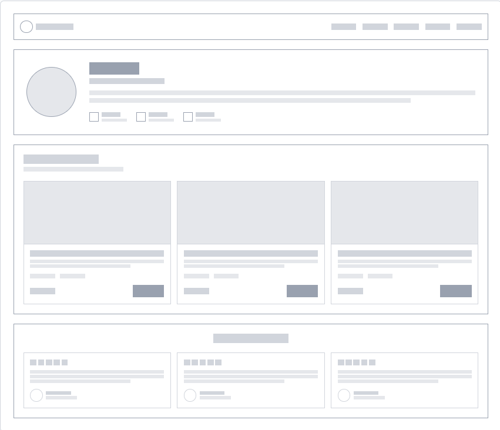
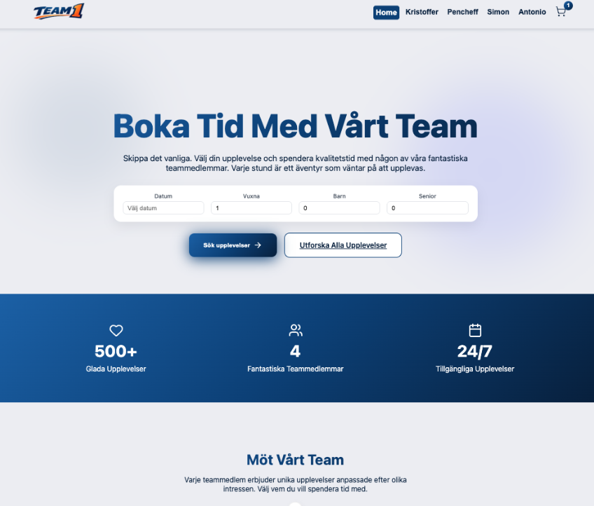
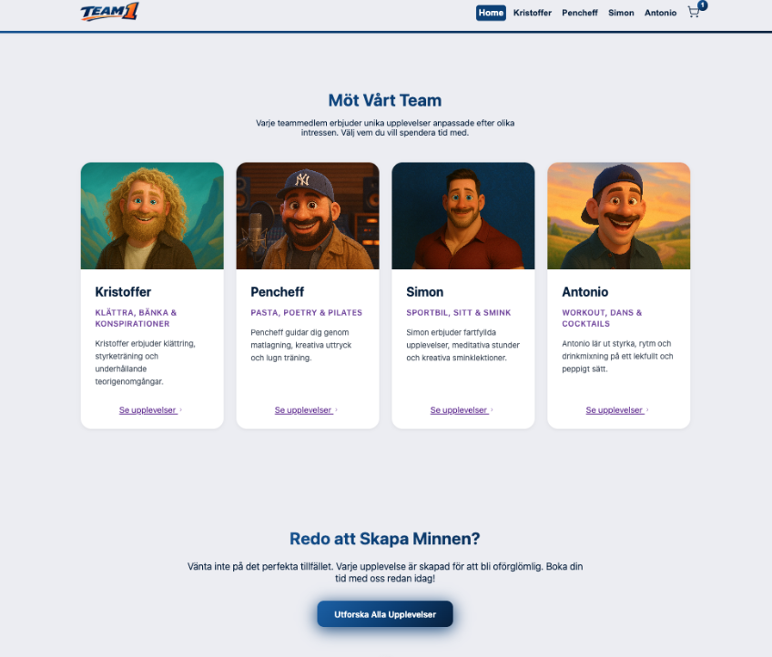
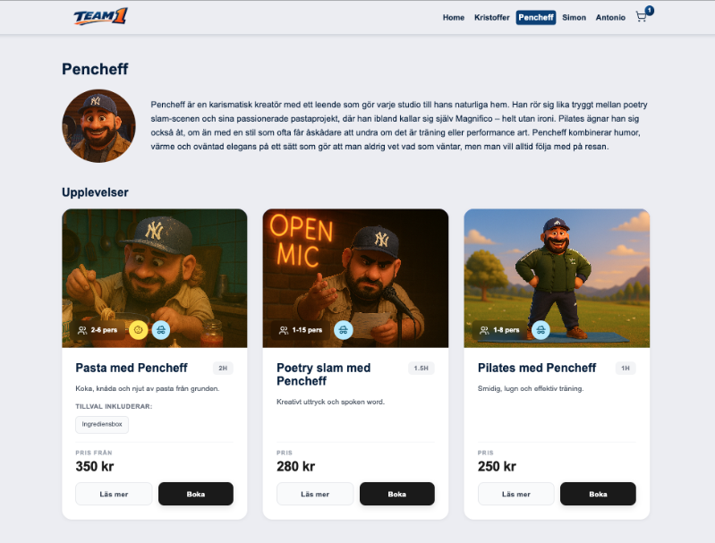
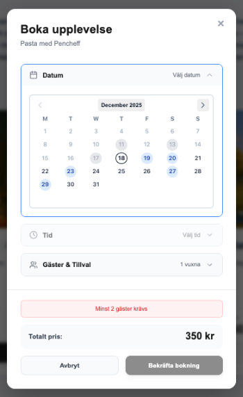
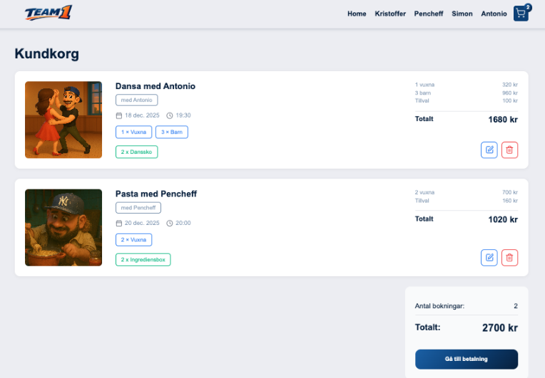
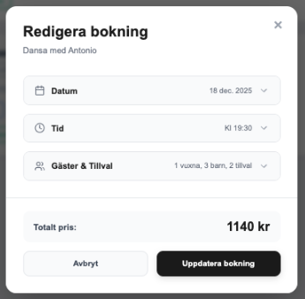
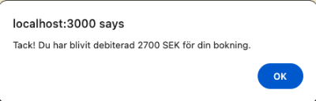

# TeamEtt Upplevelser

TeamEtt Upplevelser är ett Nuxt-baserat frontendprojekt där användare kan boka upplevelser tillsammans med teamets medlemmar. Varje medlem har en egen sida med tre unika upplevelser, och applikationen innehåller sökbar, kundvagn och paketerbjudande.

Projektet är utvecklat inom ramen för utbildning och använder lokal JSON-data utan backend.

---

## Innehållsförteckning

- [TeamEtt Upplevelser](#teamett-upplevelser)
  - [Innehållsförteckning](#innehållsförteckning)
  - [Live Site](#live-site)
  - [Projektbeskrivning](#projektbeskrivning)
  - [Teknologier](#teknologier)
    - [Språk och ramverk](#språk-och-ramverk)
    - [Bibliotek och verktyg](#bibliotek-och-verktyg)
  - [Installation och körning](#installation-och-körning)
  - [Scripts](#scripts)
  - [Wireframes](#wireframes)
    - [Starting page](#starting-page)
    - [Member page](#member-page)
    - [Eventuella nödvändiga komponenter](#eventuella-nödvändiga-komponenter)
  - [UI Screenshots – Home page](#ui-screenshots--home-page)
    - [Hero section \& sök](#hero-section--sök)
    - [Möt vårt team](#möt-vårt-team)
  - [UI Screenshots – Team member page](#ui-screenshots--team-member-page)
    - [Medlemsprofil \& upplevelser](#medlemsprofil--upplevelser)
  - [UI Screenshots – Bokningsflöde](#ui-screenshots--bokningsflöde)
    - [Bokningsmodal](#bokningsmodal)
  - [UI Screenshots – Kundkorg](#ui-screenshots--kundkorg)
    - [Kundkorg \& sammanfattning](#kundkorg--sammanfattning)
  - [UI Screenshots – Redigera bokning \& betalning](#ui-screenshots--redigera-bokning--betalning)
    - [Redigera bokning (modal)](#redigera-bokning-modal)
    - [Betalningsbekräftelse (alert)](#betalningsbekräftelse-alert)
  - [Funktionalitet](#funktionalitet)
  - [Projektstruktur](#projektstruktur)
  - [Arkitektur och flöden](#arkitektur-och-flöden)
  - [Vanliga problem](#vanliga-problem)
  - [Arbetsflöde](#arbetsflöde)
  - [Reflektion \& lärdomar](#reflektion--lärdomar)
  - [Licens](#licens)

---

## Live Site

The link to our Github repo: [Team1vue Repo](https://github.com/Team-1-VUE/team1vue)

[Back to content list](#innehållsförteckning)

---

## Projektbeskrivning

Applikationen låter användaren bläddra bland teamets medlemmar och boka upplevelser som hålls av dem. Varje medlem har en egen profilsida med information, bild och tillgängliga upplevelser.

Användaren kan välja datum, tid och antal gäster, lägga till upplevelser i kundvagnen, aktivera paketerbjudanden och använda rabattkod innan bokning.

[Back to content list](#innehållsförteckning)

---

## Teknologier

### Språk och ramverk

- JavaScript
- TypeScript
- Vue 3
- Nuxt 4

### Bibliotek och verktyg

- Pinia (state management)
- Vue Router
- V-Calendar / Vue Datepicker
- Lucide Icons
- npm
- Git & GitHub
- Visual Studio Code

[Back to content list](#innehållsförteckning)

---

## Installation och körning

För att köra projektet lokalt krävs Node.js version 18 eller högre (rekommenderat 20+), samt npm.

Projektet installeras genom att först klona repositoryt från GitHub och därefter navigera in i projektmappen. När projektet är klonat installeras alla dependencies med npm. Därefter startas utvecklingsservern.

```bash
git clone <repo-url>
cd <repo-mapp>
npm install
npm run dev
```

När servern är igång är applikationen tillgänglig på:

```
http://localhost:3000
```

[Back to content list](#innehållsförteckning)

---

## Scripts

Följande scripts finns tillgängliga i projektet:

```
npm run dev        # Startar utvecklingsserver
npm run build      # Bygger applikationen för produktion
npm run preview    # Förhandsvisar produktionsbygget lokalt
npm run generate   # Genererar statisk version
```

---

## Wireframes

### Starting page

Navbar med logo/icon och våra namn i form av länkar som tar användaren till respektive "medlemssida".
Hero section, sök, Reviews (optional), filter.

<details>

<summary> Visa wireframe – Starting page</summary>


</details>

---

### Member page

Samma navbar.
AI-genererad bild på medlem. About-section. Tre "cards" med aktiviteter, Reviews (optional).

<details>
<summary> Visa wireframe – Member page</summary>



</details>

---

### Eventuella nödvändiga komponenter

<details>
<summary> Visa wireframe – Nödvändiga komponenter</summary>


</details>

<br>

[Back to content list](#innehållsförteckning)

---

## UI Screenshots – Home page

Nedan visas den färdiga implementationen av startsidan (Home page), baserad på de framtagna wireframes.

### Hero section & sök

Visar navigation, hero-rubrik, beskrivande text samt sökfunktion för datum och antal gäster.



---

### Möt vårt team

Sektion som presenterar samtliga teammedlemmar med bild, kort beskrivning och länk till respektive medlemssida.



[Back to content list](#innehållsförteckning)

---

## UI Screenshots – Team member page

Här visas exempel på en individuell medlemssida där användaren kan läsa mer om teammedlemmen och välja bland tillgängliga upplevelser.

### Medlemsprofil & upplevelser

Sidan innehåller profilbild, beskrivande text om medlemmen samt tillhörande upplevelser med pris, kapacitet och bokningsknappar.



---

## UI Screenshots – Bokningsflöde

Här visas bokningsmodalen som används för att välja datum, tid och antal gäster innan en upplevelse läggs till i kundvagnen.

### Bokningsmodal

Bokningsmodalen innehåller datumväljare, tidsval och gästhantering samt validering av minimiantal gäster. Totalpris uppdateras dynamiskt baserat på valen.



[Back to content list](#innehållsförteckning)

---

## UI Screenshots – Kundkorg

Här visas kundkorgsvyn där användaren får en överblick över sina valda bokningar innan vidare steg mot betalning.

### Kundkorg & sammanfattning

Kundkorgen visar valda upplevelser med tillhörande datum, tid, antal gäster och tillval. Totalpris beräknas dynamiskt och uppdateras automatiskt vid ändringar.



---

## UI Screenshots – Redigera bokning & betalning

Nedan visas UI för att redigera en befintlig bokning i kundkorgen samt bekräftelse/alert efter genomförd betalning.

### Redigera bokning (modal)

Användaren kan uppdatera datum, tid, gäster och tillval för en befintlig bokning. Totalpris uppdateras och bokningen kan sparas via “Uppdatera bokning”.



[Back to content list](#innehållsförteckning)

---

### Betalningsbekräftelse (alert)

Efter att användaren går vidare till betalning visas en bekräftelse som återkopplar att debitering har skett.



---

## Funktionalitet

Applikationen innehåller följande funktioner:

- Startsida med presentation av teammedlemmar
- Medlemssidor med information och tre upplevelser
- Sök och filtrering av upplevelser
- Datum- och tidsval baserat på tillgänglighet
- Kundvagn där upplevelser kan läggas till och tas bort
- Paketerbjudande som kräver en upplevelse per medlem

<br>

[Back to content list](#innehållsförteckning)

---

## Projektstruktur

Projektet följer Nuxts rekommenderade struktur:

```
.
├─ .nuxt/                  # Nuxt dev/build cache (autogenererad)
├─ .output/                # Nuxt build output (autogenererad)
├─ components/             # Återanvändbara UI-komponenter
├─ composables/            # Composables (useXxx) och delad logik
├─ node_modules/           # Installerade dependencies (autogenererad)
├─ pages/                  # Filbaserad routing (Nuxt)
│  ├─ boka/
│  │  └─ index.vue         # /boka
│  ├─ kundkorg/
│  │  └─ index.vue         # /kundkorg
│  ├─ profil/
│  │  └─ [name].vue        # /profil/:name
│  ├─ upplevelse/
│  │  ├─ [slug].vue        # /upplevelse/:slug
│  │  └─ index.vue         # /upplevelse
│  └─ index.vue            # /
├─ plugins/                # Client-side plugins
│  ├─ router-log.client.ts # Loggning av navigation (client)
│  └─ v-calendar.client.ts # V-Calendar integration (client)
├─ public/                 # Statiska filer (serveras direkt)
│  ├─ images/              # Bilder (t.ex. upplevelser)
│  ├─ profileimages/       # Profilbilder
│  ├─ readmeimg/           # README-bilder / wireframes
│  ├─ data.json            # Datafil (innehåll)
│  └─ data2.json           # Datafil (innehåll)
├─ stores/                 # Pinia stores
│  └─ useCartStore.ts      # Kundvagn/state
├─ utils/                  # Hjälpfunktioner / utilities
│  ├─ date.ts              # Datumhantering
│  ├─ scheduleHelpers.ts   # Schema/tids-slot logik
│  └─ string.ts            # String-helpers
├─ .gitignore
├─ app.vue                 # Root-komponent
├─ error.vue               # Global error-sida
├─ nuxt.config.ts          # Nuxt-konfiguration
├─ package-lock.json
├─ package.json
├─ README.md
└─ tsconfig.json
```

[Back to content list](#innehållsförteckning)

---

## Arkitektur och flöden

Navigering och routing hanteras genom Nuxts filbaserade routing i pages/-mappen. Varje sida motsvarar en route i applikationen.

Kundvagnen hanteras globalt med Pinia, vilket gör att flera komponenter kan läsa och uppdatera samma state utan prop-drilling. Varje bokning innehåller information om upplevelse, datum, tid och antal gäster.

Paketerbjudandet aktiveras automatiskt när kundvagnen innehåller exakt en upplevelse från varje medlem. Paketets pris beräknas dynamiskt baserat på kundvagnens innehåll.

Rabattkoden aktiveras manuellt i kundvagnen och drar då av 20 % från totalbeloppet. Rabattlogiken är implementerad via beräknade värden (computed state) för att alltid vara konsekvent.

[Back to content list](#innehållsförteckning)

---

## Vanliga problem

Om port 3000 redan används kan utvecklingsservern startas på en annan port:

```
npm run dev -- --port 3001
```

Vid problem med installation eller TypeScript-fel kan följande steg hjälpa:

```
rm -rf node_modules
rm -f package-lock.json
npm install
```

[Back to content list](#innehållsförteckning)

---

## Arbetsflöde

Projektet utvecklas i feature-branches och mergeas via Pull Requests. Varje ändring granskas innan den slås ihop med main-branchen. Commit-meddelanden följer ett tydligt och konsekvent mönster såsom feat, fix och chore.

---

## Reflektion & lärdomar

Under utvecklingen av TeamEtt Upplevelser har vi lärt oss mycket om hur man bygger en komponentbaserad applikation i Nuxt och hur viktigt det är med tydlig struktur när flera personer jobbar i samma kodbas.

En av de största lärdomarna var att planera routes och dataflöden tidigt. Eftersom vi använder Nuxts filbaserade routing blev det enkelt att skapa tydliga sidor för startsida, profil och upplevelser, men det krävde att vi var konsekventa med t.ex. `slug` och `name` i datan så att routing och navigation inte gick sönder.

Vi insåg också hur mycket Pinia förenklar global state-hantering. Kundvagnen behövde fungera från flera olika vyer (lägga till, ta bort, visa totalpris, rabatt och paketlogik). Att lägga detta i en store gjorde koden mer lättläst och minskade risken för prop-drilling och dubbel-logik i flera komponenter.

Datum- och tillgänglighetslogiken var en annan del som krävde extra fokus. Vi behövde tänka på att en upplevelse kan ha flera datum och tider, och att val av gäster måste valideras mot kapacitet. Det gjorde att vi fick öva på att bryta ut logik till `utils/` (t.ex. `scheduleHelpers.ts`) istället för att ha allt direkt i komponenterna.

Som teamarbete tog vi med oss att en tydlig Git- och PR-rutin är avgörande. När flera jobbar samtidigt blir konflikter och krockar annars väldigt dyra. Med feature branches, tydliga commits och code review blev det enklare att hålla ihop kvaliteten och undvika att fel smög sig in.

Om vi skulle fortsätta vidare med projektet hade nästa steg varit att lägga till tester (t.ex. för kundvagnens beräkningar och rabatt/paketlogik), samt eventuellt flytta data från statiska JSON-filer till en enkel backend eller ett CMS för att göra innehållet mer dynamiskt.

[Back to content list](#innehållsförteckning)

---

## Licens

Detta projekt är ett utbildningsprojekt och används inom ramen för studier.

---

Happy coding 🚀
